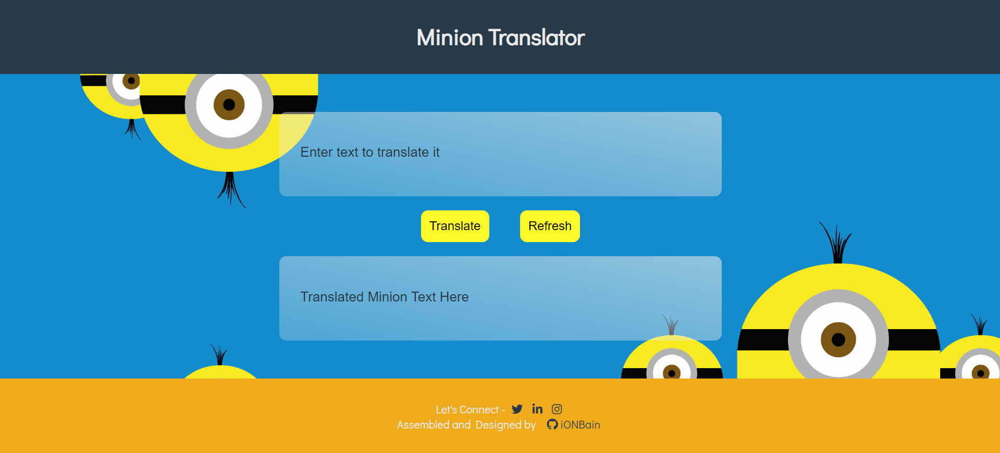
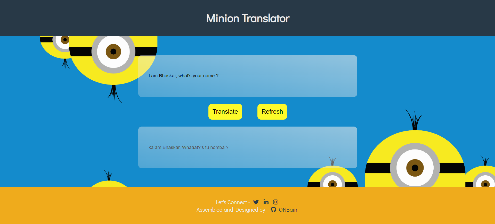

# Minion Translator App
An fun app which translates English into Minion Language.

Some of the website insights are as follows:

1. Landing page

2. Write input text, and hit translate button !

> Technologies/Concepts used :-
* Vanilla JS
* CSS
* HTML
* fetch API
* Async calls, catching JSON response and errors

> API used for the project
* [fun translations - minion](https://funtranslations.com/api/minion)
> Platform used to develop project :-
* [Visual Studio Code](https://code.visualstudio.com/)
> Platform used to host and deploy the project :-
* [Github.com](https://github.com/ionbain)
* [Netlify.com](https://app.netlify.com/teams/bhaskartx/)

